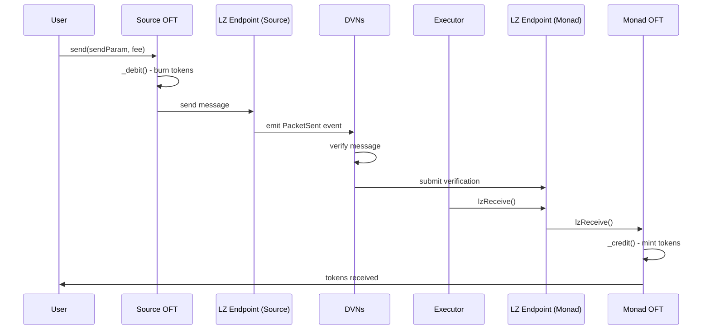

# LayerZero Cross-Chain Implementation Guide
## Bridging from Any Testnet to Monad Testnet

**Monad as Settlement Layer**

---

## Table of Contents

1. [Architecture Overview](#architecture-overview)
2. [LayerZero Testnet Configuration](#layerzero-testnet-configuration)
3. [Smart Contract Implementation](#smart-contract-implementation)
4. [Deployment & Configuration](#deployment--configuration)
5. [Bridging Tokens to Monad](#bridging-tokens-to-monad)
6. [Message Flow & Settlement](#message-flow--settlement)
7. [Testing & Verification](#testing--verification)
8. [Complete Project Structure](#complete-project-structure)
9. [Troubleshooting](#troubleshooting)

---

## Architecture Overview

```
┌─────────────────┐     LayerZero V2      ┌─────────────────┐
│  Source Testnet │  ─────────────────▶   │  Monad Testnet  │
│  (Sepolia, etc) │     OFT Transfer      │  (Settlement)   │
└─────────────────┘                       └─────────────────┘
        │                                         │
        │                                         │
   Deploy OFT                              Deploy OFT (peer)
   (Lock/Burn)                             (Mint/Release)
```

### Key Concepts

- **OFT (Omnichain Fungible Token)**: A token standard that exists natively on multiple chains
- **Endpoint**: LayerZero's protocol contract on each chain
- **EID (Endpoint ID)**: Unique identifier for each chain in LayerZero
- **Peer**: The OFT contract address on the destination chain
- **Settlement Layer**: Monad testnet where final token state is recorded

---

## LayerZero Testnet Configuration

### Monad Testnet Addresses

| Component | Address | Description |
|-----------|---------|-------------|
| **Endpoint V2** | `0x6C7Ab2202C98C4227C5c46f1417D81144DA716Ff` | Main protocol entry point |
| **SendUln302** | `0xd682ECF100f6F4284138AA925348633B0611Ae21` | Send message library |
| **ReceiveUln302** | `0xcF1B0F4106B0324F96fEfcC31bA9498caa80701C` | Receive message library |
| **LZExecutor** | `0x9dB9Ca3305B48F196D18082e91cB64663b13d014` | Executor service |
| **Endpoint ID (EID)** | `40204` | Monad's unique chain identifier |

### Common Source Chain Testnet Configuration

| Chain | Endpoint V2 Address | EID | RPC URL |
|-------|-------------------|-----|---------|
| **Ethereum Sepolia** | `0x6EDCE65403992e310A62460808c4b910D972f10f` | `40161` | https://rpc.sepolia.org |
| **Arbitrum Sepolia** | `0x6EDCE65403992e310A62460808c4b910D972f10f` | `40231` | https://sepolia-rollup.arbitrum.io/rpc |
| **Optimism Sepolia** | `0x6EDCE65403992e310A62460808c4b910D972f10f` | `40232` | https://sepolia.optimism.io |
| **Base Sepolia** | `0x6EDCE65403992e310A62460808c4b910D972f10f` | `40245` | https://sepolia.base.org |
| **Polygon Amoy** | `0x6EDCE65403992e310A62460808c4b910D972f10f` | `40267` | https://rpc-amoy.polygon.technology |

> **Note**: Monad Testnet RPC: `https://testnet.monad.xyz`

---

## Smart Contract Implementation

### Prerequisites

```bash
# Install dependencies
npm install @layerzerolabs/lz-evm-oapp-v2 @layerzerolabs/lz-evm-protocol-v2
npm install @openzeppelin/contracts

# Or with Foundry
forge install layerzero-labs/lz-evm-oapp-v2
forge install openzeppelin/openzeppelin-contracts
```

### Contract 1: Source Chain OFT

Deploy this on your source testnet (e.g., Sepolia, Arbitrum Sepolia, etc.)

```solidity
// SPDX-License-Identifier: MIT
pragma solidity ^0.8.22;

import {OFT} from "@layerzerolabs/lz-evm-oapp-v2/contracts/oft/OFT.sol";
import {Ownable} from "@openzeppelin/contracts/access/Ownable.sol";

/**
 * @title CrossChainToken
 * @notice Omnichain Fungible Token that can be bridged to Monad
 * @dev Deploy this on source testnet (e.g., Sepolia)
 * 
 * Features:
 * - Burns tokens on source chain when bridging
 * - Mints tokens on destination (Monad) when receiving
 * - Fully compatible with LayerZero V2
 */
contract CrossChainToken is OFT {
    constructor(
        string memory _name,
        string memory _symbol,
        address _lzEndpoint,     // LayerZero Endpoint for source chain
        address _owner
    ) OFT(_name, _symbol, _lzEndpoint, _owner) Ownable(_owner) {}

    /**
     * @notice Mint initial token supply (only owner)
     * @param _to Recipient address
     * @param _amount Amount to mint
     */
    function mint(address _to, uint256 _amount) external onlyOwner {
        _mint(_to, _amount);
    }
}
```

### Contract 2: Monad Settlement OFT

Deploy this on Monad testnet as the settlement layer.

```solidity
// SPDX-License-Identifier: MIT
pragma solidity ^0.8.22;

import {OFT} from "@layerzerolabs/lz-evm-oapp-v2/contracts/oft/OFT.sol";
import {Ownable} from "@openzeppelin/contracts/access/Ownable.sol";

/**
 * @title CrossChainTokenMonad
 * @notice OFT on Monad that receives tokens from source chains
 * @dev Monad serves as the settlement layer for cross-chain token transfers
 * 
 * Settlement Features:
 * - Receives and mints tokens from any connected chain
 * - Maintains canonical token supply on Monad
 * - Burns tokens when bridging back to source chains
 */
contract CrossChainTokenMonad is OFT {
    // Monad testnet LayerZero endpoint
    address constant MONAD_ENDPOINT = 0x6C7Ab2202C98C4227C5c46f1417D81144DA716Ff;
    
    constructor(
        string memory _name,
        string memory _symbol,
        address _owner
    ) OFT(_name, _symbol, MONAD_ENDPOINT, _owner) Ownable(_owner) {}
    
    /**
     * @notice Get the chain where this token is deployed
     * @return Chain identifier string
     */
    function getChain() external pure returns (string memory) {
        return "Monad Testnet - Settlement Layer";
    }
}
```

### Contract 3: Bridge Helper (Optional)

Simplifies bridging operations with a clean interface.

```solidity
// SPDX-License-Identifier: MIT
pragma solidity ^0.8.22;

import {IOFT, SendParam, MessagingFee, MessagingReceipt, OFTReceipt} from "@layerzerolabs/lz-evm-oapp-v2/contracts/oft/interfaces/IOFT.sol";
import {IERC20} from "@openzeppelin/contracts/token/ERC20/IERC20.sol";

/**
 * @title TokenBridge
 * @notice Helper contract to simplify cross-chain token transfers
 * @dev Wraps LayerZero OFT functionality with a user-friendly interface
 */
contract TokenBridge {
    IOFT public immutable token;
    
    uint32 public constant MONAD_EID = 40204;
    uint16 public constant MSG_TYPE_SEND = 1;
    
    error InsufficientFee(uint256 required, uint256 provided);
    error TransferFailed();
    
    constructor(address _token) {
        token = IOFT(_token);
    }
    
    /**
     * @notice Bridge tokens to Monad testnet
     * @param _amount Amount to bridge (in wei)
     * @param _recipient Recipient address on Monad
     * @param _gasLimit Gas limit for execution on Monad (default: 200000)
     * @return guid Unique identifier for the cross-chain message
     */
    function bridgeToMonad(
        uint256 _amount,
        address _recipient,
        uint128 _gasLimit
    ) external payable returns (bytes32 guid) {
        // Transfer tokens from user
        bool success = IERC20(address(token)).transferFrom(msg.sender, address(this), _amount);
        if (!success) revert TransferFailed();
        
        // Approve OFT contract
        IERC20(address(token)).approve(address(token), _amount);
        
        // Prepare send parameters
        bytes32 toAddress = bytes32(uint256(uint160(_recipient)));
        
        // Build options with gas limit
        bytes memory options = _buildOptions(_gasLimit);
        
        SendParam memory sendParam = SendParam({
            dstEid: MONAD_EID,
            to: toAddress,
            amountLD: _amount,
            minAmountLD: _amount, // No slippage tolerance
            extraOptions: options,
            composeMsg: "",
            oftCmd: ""
        });
        
        // Quote the messaging fee
        MessagingFee memory fee = token.quoteSend(sendParam, false);
        
        if (msg.value < fee.nativeFee) {
            revert InsufficientFee(fee.nativeFee, msg.value);
        }
        
        // Execute cross-chain send
        (guid, , ) = token.send{value: fee.nativeFee}(
            sendParam,
            fee,
            msg.sender // Refund address for excess fee
        );
        
        emit BridgedToMonad(guid, msg.sender, _recipient, _amount, fee.nativeFee);
    }
    
    /**
     * @notice Quote the fee for bridging tokens
     * @param _amount Amount to bridge
     * @param _gasLimit Gas limit for destination execution
     * @return nativeFee Fee in native token (ETH/MATIC/etc.)
     */
    function quoteBridgeFee(
        uint256 _amount,
        uint128 _gasLimit
    ) external view returns (uint256 nativeFee) {
        bytes32 toAddress = bytes32(uint256(uint160(msg.sender)));
        bytes memory options = _buildOptions(_gasLimit);
        
        SendParam memory sendParam = SendParam({
            dstEid: MONAD_EID,
            to: toAddress,
            amountLD: _amount,
            minAmountLD: _amount,
            extraOptions: options,
            composeMsg: "",
            oftCmd: ""
        });
        
        MessagingFee memory fee = token.quoteSend(sendParam, false);
        return fee.nativeFee;
    }
    
    /**
     * @dev Build LayerZero options for executor
     */
    function _buildOptions(uint128 _gasLimit) internal pure returns (bytes memory) {
        // Options format: <version><executorLzReceiveOption>
        // version = 1 (uint16)
        // gasLimit = _gasLimit (uint128)
        // msgValue = 0 (uint128)
        return abi.encodePacked(uint16(1), _gasLimit, uint128(0));
    }
    
    event BridgedToMonad(
        bytes32 indexed guid,
        address indexed sender,
        address recipient,
        uint256 amount,
        uint256 fee
    );
}
```

---

## Deployment & Configuration

### Step 1: Project Setup

Create your project structure:

```bash
mkdir monad-layerzero-bridge
cd monad-layerzero-bridge

# Initialize Foundry project
forge init

# Install dependencies
forge install layerzero-labs/lz-evm-oapp-v2
forge install openzeppelin/openzeppelin-contracts
```

Update `foundry.toml`:

```toml
[profile.default]
src = "src"
out = "out"
libs = ["lib"]
solc_version = "0.8.22"

[rpc_endpoints]
sepolia = "${SEPOLIA_RPC_URL}"
monad_testnet = "${MONAD_RPC_URL}"

[etherscan]
sepolia = { key = "${ETHERSCAN_API_KEY}" }
```

Create `.env`:

```bash
PRIVATE_KEY=your_private_key_here
SEPOLIA_RPC_URL=https://rpc.sepolia.org
MONAD_RPC_URL=https://testnet.monad.xyz
ETHERSCAN_API_KEY=your_etherscan_api_key
```

### Step 2: Deployment Script

Create `script/DeployOFT.s.sol`:

```solidity
// SPDX-License-Identifier: MIT
pragma solidity ^0.8.22;

import "forge-std/Script.sol";
import "../src/CrossChainToken.sol";
import "../src/CrossChainTokenMonad.sol";
import "../src/TokenBridge.sol";

contract DeployOFT is Script {
    // LayerZero Endpoints
    address constant SEPOLIA_ENDPOINT = 0x6EDCE65403992e310A62460808c4b910D972f10f;
    address constant MONAD_ENDPOINT = 0x6C7Ab2202C98C4227C5c46f1417D81144DA716Ff;
    
    // Endpoint IDs
    uint32 constant SEPOLIA_EID = 40161;
    uint32 constant MONAD_EID = 40204;
    
    function run() external {
        uint256 deployerPrivateKey = vm.envUint("PRIVATE_KEY");
        address deployer = vm.addr(deployerPrivateKey);
        
        console.log("Deployer:", deployer);
        console.log("\n=== STEP 1: Deploy on Sepolia ===");
        
        // 1. Deploy on Sepolia (Source)
        vm.createSelectFork("sepolia");
        vm.startBroadcast(deployerPrivateKey);
        
        CrossChainToken sourceToken = new CrossChainToken(
            "CrossChain Token",
            "CCT",
            SEPOLIA_ENDPOINT,
            deployer
        );
        
        console.log("Source Token (Sepolia):", address(sourceToken));
        
        // Mint initial supply on source
        sourceToken.mint(deployer, 1_000_000 * 10**18); // 1M tokens
        console.log("Minted 1,000,000 CCT to deployer");
        
        vm.stopBroadcast();
        
        console.log("\n=== STEP 2: Deploy on Monad ===");
        
        // 2. Deploy on Monad (Settlement)
        vm.createSelectFork("monad_testnet");
        vm.startBroadcast(deployerPrivateKey);
        
        CrossChainTokenMonad monadToken = new CrossChainTokenMonad(
            "CrossChain Token",
            "CCT",
            deployer
        );
        
        console.log("Monad Token:", address(monadToken));
        
        vm.stopBroadcast();
        
        console.log("\n=== STEP 3: Configure Peers ===");
        
        // 3. Set Monad as peer on Sepolia
        vm.createSelectFork("sepolia");
        vm.startBroadcast(deployerPrivateKey);
        
        bytes32 monadPeerBytes32 = bytes32(uint256(uint160(address(monadToken))));
        sourceToken.setPeer(MONAD_EID, monadPeerBytes32);
        console.log("Set Monad as peer on Sepolia");
        
        vm.stopBroadcast();
        
        // 4. Set Sepolia as peer on Monad
        vm.createSelectFork("monad_testnet");
        vm.startBroadcast(deployerPrivateKey);
        
        bytes32 sepoliaPeerBytes32 = bytes32(uint256(uint160(address(sourceToken))));
        monadToken.setPeer(SEPOLIA_EID, sepoliaPeerBytes32);
        console.log("Set Sepolia as peer on Monad");
        
        vm.stopBroadcast();
        
        console.log("\n=== STEP 4: Deploy Bridge Helper (Optional) ===");
        
        vm.createSelectFork("sepolia");
        vm.startBroadcast(deployerPrivateKey);
        
        TokenBridge bridge = new TokenBridge(address(sourceToken));
        console.log("Bridge Helper:", address(bridge));
        
        vm.stopBroadcast();
        
        console.log("\n=== DEPLOYMENT COMPLETE ===");
        console.log("\nContract Addresses:");
        console.log("Sepolia Token:", address(sourceToken));
        console.log("Monad Token:", address(monadToken));
        console.log("Bridge Helper:", address(bridge));
        
        console.log("\nNext Steps:");
        console.log("1. Fund deployer with testnet ETH on Sepolia");
        console.log("2. Run bridge script to test cross-chain transfer");
        console.log("3. Verify contracts on block explorers");
    }
}
```

### Step 3: Execute Deployment

```bash
# Load environment variables
source .env

# Deploy all contracts
forge script script/DeployOFT.s.sol:DeployOFT --broadcast --verify

# Save deployment addresses
# Sepolia Token: 0x...
# Monad Token: 0x...
# Bridge Helper: 0x...
```

---

## Bridging Tokens to Monad

### Method 1: Using TypeScript/Ethers.js

Create `scripts/bridge.ts`:

```typescript
import { ethers } from 'ethers';

// Configuration
const SEPOLIA_RPC = 'https://rpc.sepolia.org';
const MONAD_RPC = 'https://testnet.monad.xyz';
const PRIVATE_KEY = process.env.PRIVATE_KEY!;

// Contract addresses (from deployment)
const SOURCE_OFT_ADDRESS = '0xYourSepoliaOFTAddress';
const MONAD_OFT_ADDRESS = '0xYourMonadOFTAddress';

// Chain IDs
const MONAD_EID = 40204;

/**
 * Bridge tokens from Sepolia to Monad
 */
async function bridgeTokensToMonad(
  amount: string,
  recipientOnMonad: string
) {
  console.log('🌉 Starting cross-chain bridge to Monad...\n');
  
  // Connect to Sepolia
  const sepoliaProvider = new ethers.JsonRpcProvider(SEPOLIA_RPC);
  const signer = new ethers.Wallet(PRIVATE_KEY, sepoliaProvider);
  
  console.log('Bridging from:', await signer.getAddress());
  console.log('Amount:', amount, 'CCT');
  console.log('Recipient on Monad:', recipientOnMonad, '\n');
  
  // OFT ABI
  const oftAbi = [
    'function send((uint32 dstEid, bytes32 to, uint256 amountLD, uint256 minAmountLD, bytes extraOptions, bytes composeMsg, bytes oftCmd) _sendParam, (uint256 nativeFee, uint256 lzTokenFee) _fee, address _refundAddress) external payable returns (tuple(bytes32 guid, uint64 nonce, tuple(uint256 nativeFee, uint256 lzTokenFee) fee))',
    'function quoteSend((uint32 dstEid, bytes32 to, uint256 amountLD, uint256 minAmountLD, bytes extraOptions, bytes composeMsg, bytes oftCmd) _sendParam, bool _payInLzToken) external view returns (tuple(uint256 nativeFee, uint256 lzTokenFee))',
    'function balanceOf(address) external view returns (uint256)'
  ];
  
  const oft = new ethers.Contract(SOURCE_OFT_ADDRESS, oftAbi, signer);
  
  // Check balance
  const balance = await oft.balanceOf(await signer.getAddress());
  console.log('Current balance:', ethers.formatEther(balance), 'CCT');
  
  const amountWei = ethers.parseEther(amount);
  
  if (balance < amountWei) {
    throw new Error('Insufficient balance');
  }
  
  // Convert recipient to bytes32
  const toAddress = ethers.zeroPadValue(recipientOnMonad, 32);
  
  // Build executor options (200k gas for lzReceive)
  const options = ethers.solidityPacked(
    ['uint16', 'uint128', 'uint128'],
    [1, 200000, 0]  // version, gasLimit, msgValue
  );
  
  const sendParam = {
    dstEid: MONAD_EID,
    to: toAddress,
    amountLD: amountWei,
    minAmountLD: amountWei,
    extraOptions: options,
    composeMsg: '0x',
    oftCmd: '0x'
  };
  
  // Quote the fee
  console.log('⏳ Quoting cross-chain fee...');
  const fee = await oft.quoteSend(sendParam, false);
  console.log('Cross-chain fee:', ethers.formatEther(fee.nativeFee), 'ETH\n');
  
  // Send tokens
  console.log('📤 Sending tokens to Monad...');
  const tx = await oft.send(
    sendParam,
    fee,
    await signer.getAddress(),
    { value: fee.nativeFee }
  );
  
  console.log('Transaction hash:', tx.hash);
  console.log('⏳ Waiting for confirmation...\n');
  
  const receipt = await tx.wait();
  console.log('✅ Transaction confirmed!');
  
  // Extract GUID from logs
  const iface = new ethers.Interface(oftAbi);
  for (const log of receipt.logs) {
    try {
      const parsed = iface.parseLog(log);
      if (parsed?.name === 'OFTSent') {
        console.log('\n📋 Message Details:');
        console.log('GUID:', parsed.args.guid);
        console.log('\n🔍 Track your message at:');
        console.log(`https://testnet.layerzeroscan.com/tx/${parsed.args.guid}`);
      }
    } catch (e) {
      // Ignore non-matching logs
    }
  }
  
  console.log('\n⏳ Waiting for message delivery to Monad...');
  console.log('This usually takes 1-5 minutes.');
}

// Example usage
bridgeTokensToMonad(
  '100',  // 100 CCT tokens
  '0xYourRecipientAddressOnMonad'
).catch(console.error);
```

Run the script:

```bash
npx ts-node scripts/bridge.ts
```

### Method 2: Using Foundry Script

Create `script/BridgeTokens.s.sol`:

```solidity
// SPDX-License-Identifier: MIT
pragma solidity ^0.8.22;

import "forge-std/Script.sol";
import {IOFT, SendParam, MessagingFee} from "@layerzerolabs/lz-evm-oapp-v2/contracts/oft/interfaces/IOFT.sol";

contract BridgeTokens is Script {
    uint32 constant MONAD_EID = 40204;
    
    function run() external {
        uint256 privateKey = vm.envUint("PRIVATE_KEY");
        address oftAddress = vm.envAddress("SOURCE_OFT_ADDRESS");
        address recipient = vm.envAddress("RECIPIENT_ADDRESS");
        uint256 amount = vm.envUint("BRIDGE_AMOUNT"); // in wei
        
        vm.startBroadcast(privateKey);
        
        IOFT oft = IOFT(oftAddress);
        
        // Prepare send params
        bytes32 toAddress = bytes32(uint256(uint160(recipient)));
        bytes memory options = abi.encodePacked(uint16(1), uint128(200000), uint128(0));
        
        SendParam memory sendParam = SendParam({
            dstEid: MONAD_EID,
            to: toAddress,
            amountLD: amount,
            minAmountLD: amount,
            extraOptions: options,
            composeMsg: "",
            oftCmd: ""
        });
        
        // Quote fee
        MessagingFee memory fee = oft.quoteSend(sendParam, false);
        console.log("Fee:", fee.nativeFee);
        
        // Send
        oft.send{value: fee.nativeFee}(
            sendParam,
            fee,
            vm.addr(privateKey)
        );
        
        console.log("Tokens sent to Monad!");
        
        vm.stopBroadcast();
    }
}
```

Run:

```bash
export SOURCE_OFT_ADDRESS=0x...
export RECIPIENT_ADDRESS=0x...
export BRIDGE_AMOUNT=100000000000000000000  # 100 tokens

forge script script/BridgeTokens.s.sol:BridgeTokens --rpc-url sepolia --broadcast
```

---

## Message Flow & Settlement

### Cross-Chain Message Lifecycle



### Settlement Process

1. **Initiation (Source Chain)**
   - User calls `send()` on source OFT
   - Tokens are burned/locked on source
   - Message emitted to LayerZero endpoint

2. **Verification (Off-chain)**
   - DVNs (Decentralized Verifier Networks) monitor source chain
   - Multiple independent verifiers confirm the transaction
   - Verification proofs submitted to destination

3. **Execution (Monad)**
   - Executor picks up verified message
   - Calls `lzReceive()` on Monad endpoint
   - Monad OFT mints tokens to recipient

4. **Finality (Settlement)**
   - Tokens now exist on Monad (settlement layer)
   - Transaction recorded permanently
   - User can interact with tokens on Monad

**Typical Timeline:**
- Verification: 30-60 seconds
- Execution: 30-120 seconds
- **Total: 1-5 minutes**

---

## Testing & Verification

### Verify on LayerZero Scan

**Testnet Explorer:** https://testnet.layerzeroscan.com

Search by:
- Transaction hash (source chain)
- Message GUID
- Wallet address

### Check Token Balance on Monad

```typescript
async function checkMonadBalance(address: string) {
  const monadProvider = new ethers.JsonRpcProvider('https://testnet.monad.xyz');
  
  const oftAbi = ['function balanceOf(address) view returns (uint256)'];
  const monadOFT = new ethers.Contract(
    MONAD_OFT_ADDRESS,
    oftAbi,
    monadProvider
  );
  
  const balance = await monadOFT.balanceOf(address);
  console.log('Balance on Monad:', ethers.formatEther(balance), 'CCT');
}
```

### Manual Message Status Check

```typescript
async function checkMessageStatus(guid: string) {
  const response = await fetch(
    `https://testnet-api.layerzero-scan.com/v1/messages/${guid}`
  );
  
  const data = await response.json();
  
  console.log('Status:', data.status); // INFLIGHT, DELIVERED, FAILED
  console.log('Source TX:', data.src.txHash);
  console.log('Destination TX:', data.dst.txHash);
  
  return data;
}
```

### Test Checklist

- [ ] Deploy OFT on source testnet
- [ ] Deploy OFT on Monad testnet
- [ ] Configure peer relationships
- [ ] Mint tokens on source
- [ ] Approve tokens for bridge
- [ ] Quote bridge fee
- [ ] Execute bridge transaction
- [ ] Monitor on LayerZero Scan
- [ ] Verify balance on Monad
- [ ] Test reverse bridge (Monad → Source)

---

## Complete Project Structure

```
monad-layerzero-bridge/
├── src/
│   ├── CrossChainToken.sol           # Source chain OFT
│   ├── CrossChainTokenMonad.sol      # Monad settlement OFT
│   └── TokenBridge.sol               # Bridge helper
├── script/
│   ├── DeployOFT.s.sol               # Deployment script
│   ├── BridgeTokens.s.sol            # Bridging script
│   └── ConfigurePeers.s.sol          # Peer configuration
├── test/
│   ├── OFT.t.sol                     # Unit tests
│   └── Bridge.t.sol                  # Integration tests
├── scripts/
│   ├── bridge.ts                     # TypeScript bridge script
│   └── verify.ts                     # Verification script
├── lib/
│   ├── lz-evm-oapp-v2/              # LayerZero contracts
│   └── openzeppelin-contracts/       # OpenZeppelin
├── foundry.toml                      # Foundry config
├── remappings.txt                    # Import mappings
├── package.json                      # Node dependencies
├── tsconfig.json                     # TypeScript config
└── .env                              # Environment variables
```

---

## Troubleshooting

### Common Issues

#### 1. "Insufficient fee" Error

**Problem:** Transaction reverts with insufficient fee.

**Solution:**
```typescript
// Add 10% buffer to quoted fee
const fee = await oft.quoteSend(sendParam, false);
const feeWithBuffer = (fee.nativeFee * 110n) / 100n;

await oft.send(sendParam, fee, refundAddress, {
  value: feeWithBuffer
});
```

#### 2. "Peer not set" Error

**Problem:** `setPeer()` not called or incorrect peer address.

**Solution:**
```bash
# Verify peer is set
cast call $SOURCE_OFT_ADDRESS "peers(uint32)(bytes32)" 40204 --rpc-url sepolia

# Should return non-zero bytes32
# If zero, run setPeer again
```

#### 3. Message Stuck "INFLIGHT"

**Problem:** Message not delivered after 10+ minutes.

**Solution:**
- Check LayerZero Scan for error details
- Verify destination chain RPC is working
- Ensure executor has sufficient gas
- Contact LayerZero Discord if issue persists

#### 4. Tokens Not Appearing on Monad

**Problem:** Transaction confirmed but no tokens on Monad.

**Solution:**
```typescript
// Check if message was delivered
const delivered = await monadEndpoint.inboundNonce(
  monadOftAddress,
  sourceEid,
  sourcePeerBytes32
);

// If nonce > 0, message was received
// Check OFT balance directly
```

### Gas Optimization Tips

1. **Adjust Gas Limit**: Start with 200k, reduce if successful
2. **Batch Transfers**: Send larger amounts less frequently
3. **Use Native Tokens**: Pay fees in native token (not LZ token)
4. **Monitor Gas Prices**: Bridge during low congestion

### Security Best Practices

1. **Test Thoroughly**: Always test on testnet first
2. **Small Amounts First**: Bridge small amounts initially
3. **Verify Contracts**: Verify all contracts on block explorers
4. **Use Multisig**: For production, use multisig as owner
5. **Monitor Events**: Watch for unexpected OFT events

---

## Additional Resources

### Official Documentation

- **LayerZero V2 Docs**: https://docs.layerzero.network/v2
- **Monad Documentation**: https://docs.monad.xyz
- **LayerZero GitHub**: https://github.com/LayerZero-Labs
- **Monad Protocols Repo**: https://github.com/monad-crypto/protocols

### Community

- **LayerZero Discord**: https://discord.gg/layerzero
- **Monad Discord**: https://discord.gg/monad
- **LayerZero Scan (Testnet)**: https://testnet.layerzeroscan.com

### Block Explorers

- **Monad Testnet**: https://testnet.monadvision.com
- **Sepolia**: https://sepolia.etherscan.io

---

## Appendix: Quick Reference

### Key Addresses

```bash
# Monad Testnet
MONAD_ENDPOINT=0x6C7Ab2202C98C4227C5c46f1417D81144DA716Ff
MONAD_EID=40204
MONAD_RPC=https://testnet.monad.xyz

# Sepolia
SEPOLIA_ENDPOINT=0x6EDCE65403992e310A62460808c4b910D972f10f
SEPOLIA_EID=40161
SEPOLIA_RPC=https://rpc.sepolia.org
```

### Common Commands

```bash
# Deploy
forge script script/DeployOFT.s.sol --broadcast --verify

# Bridge tokens
forge script script/BridgeTokens.s.sol --broadcast

# Check balance
cast call $OFT_ADDRESS "balanceOf(address)(uint256)" $ADDRESS --rpc-url $RPC

# Check peer
cast call $OFT_ADDRESS "peers(uint32)(bytes32)" $EID --rpc-url $RPC

# Set peer
cast send $OFT_ADDRESS "setPeer(uint32,bytes32)" $EID $PEER_BYTES32 --private-key $PK --rpc-url $RPC
```

### ABI Snippets

```typescript
// Essential OFT functions
const oftAbi = [
  'function send((uint32,bytes32,uint256,uint256,bytes,bytes,bytes),(uint256,uint256),address) payable returns (tuple)',
  'function quoteSend((uint32,bytes32,uint256,uint256,bytes,bytes,bytes),bool) view returns (tuple)',
  'function setPeer(uint32,bytes32)',
  'function peers(uint32) view returns (bytes32)',
  'function balanceOf(address) view returns (uint256)'
];
```

---

## Changelog

### v1.0.0 (Current)
- Initial guide for LayerZero V2 on Monad testnet
- OFT deployment and configuration
- TypeScript and Foundry examples
- Comprehensive troubleshooting section

---

**Last Updated:** February 16, 2026  
**LayerZero Version:** V2  
**Monad Testnet:** Active  
**Author:** OpenCode Assistant

---

For questions or issues, please reach out on:
- Monad Discord: https://discord.gg/monad
- LayerZero Discord: https://discord.gg/layerzero
